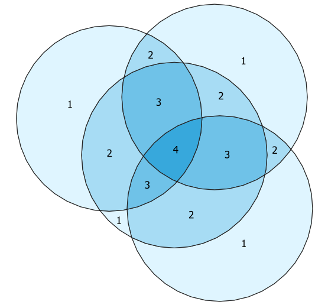

# Count Polygon Overlap

Count Polygon Overlap is a QGIS model to count the number of polygons overlapping each area.  This model can be run on any polygon layer that has a field containing unique IDs.

The test dataset a polygon layer that contains four circular areas and an "fid" field containing unique ids.

After running the model (and applying some styles and labels) the result looks like this:

To use the model, first [download the count-polygon-overlap.model3](https://github.com/kgjenkins/qgis-count-polygon-overlap/raw/master/count-polygon-overlap.model3) file to your computer.  (It's the only file in this repo that you'll need.)

There a couple of different ways to run the model in QGIS.  Here's one:

1. Processing menu > Graphical Modeler...
2. Open Model
3. Click the "run" button (green triangle) in the toolbar
